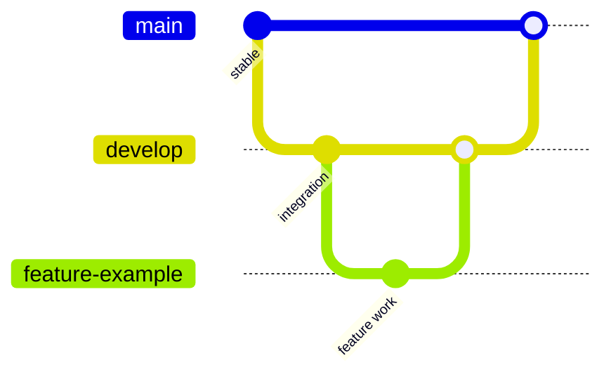

<div align="center">

# OncoFlow

### Integrated Oncology Care Coordination & Workflow Platform

**CSYE 7230 · Team Fire Control**

<br />

[](#project-status)
[](https://react.dev/)
[](https://www.typescriptlang.org/)
[](https://nodejs.org/)
[](https://www.postgresql.org/)
[](https://www.docker.com/)
[](https://github.com/features/actions)

<br />

A workflow-oriented oncology care platform designed to coordinate patients,
clinicians, laboratories, pharmacies, insurance personnel, and administrators
through secure, traceable, role-based workflows.

</div>

---

## Overview

Cancer care involves a sequence of interconnected activities across multiple stakeholders, including diagnostic testing, treatment planning, medication fulfillment, insurance authorization, patient monitoring, and clinical follow-up.

When these activities are handled through disconnected workflows, participants may have limited visibility into:

- what has already been completed,
- what remains pending,
- who owns the next action, and
- how the patient's overall care journey is progressing.

**OncoFlow** addresses this problem through a unified web platform focused on workflow orchestration, task visibility, role-based access control, and traceable cross-department handoffs.

The application is being developed as an academic software prototype using synthetic patient information only.

---

## Core Design

OncoFlow is centered around two primary workflow concepts.

### Unified Patient Care Timeline

Important events generated across clinical and administrative workflows are organized chronologically, allowing authorized users to understand the progression of a patient's care journey.

### Role-Based Work Queues

Actions performed by one role can create downstream work for another role, establishing clear ownership and traceable handoffs between departments.


---

## Team

### Fire Control

| Team Member | NUID |
|---|---:|
| **Aaryak Pawar** | `002065641` |
| **Jamal Opeyemi Akinlabi** | `001647538` |

---

## User Roles

| Role | Primary Responsibility |
|---|---|
| Patient | View relevant care progress, milestones, prescriptions, diagnostics, and authorization status |
| Doctor / Oncologist | Manage treatment plans, diagnostic requests, prescriptions, and clinical workflows |
| Nurse | Record care updates, vitals, observations, and treatment progress |
| Laboratory Technician | Process diagnostic requests and publish results |
| Pharmacist | Process prescriptions and manage fulfillment status |
| Insurance Officer | Review authorization requests and update administrative status |
| System Administrator | Manage users, permissions, system activity, audit history, and operational analytics |

---

## Functional Scope

The following capabilities define the planned prototype scope; they are not yet implemented.

### Identity & Access

- Secure user authentication
- Role-Based Access Control
- Server-side authorization
- Account administration
- Audit logging

### Patient Care

- Patient profiles
- Unified patient care timeline
- Treatment planning
- Nursing updates
- Care milestone tracking

### Diagnostic Workflow

- Diagnostic request creation
- Laboratory work queues
- Request-status management
- Diagnostic-result publication
- Clinical review handoff

### Pharmacy Workflow

- Prescription creation
- Pharmacy work queues
- Fulfillment tracking
- Prescription-status visibility

### Insurance Workflow

- Authorization request submission
- Insurance review
- Approval, rejection, or additional-information status
- Clinical and patient visibility

### Workflow Operations

- Role-specific work queues
- Cross-role handoffs
- Workflow notifications
- Operational dashboards
- Audit trail
- Administrative analytics

---

## Technology Stack

The technologies below are planned selections. Application code, dependency versions, and deployment configuration have not yet been initialized.

### Application Layer


### Data Layer


### Quality & Delivery


| Layer | Planned Technology |
|---|---|
| Frontend | React, TypeScript, MUI |
| Backend | Node.js, Express, TypeScript |
| API | REST |
| Database | PostgreSQL |
| ORM | Prisma |
| Authentication | JWT, bcrypt |
| Authorization | Role-Based Access Control |
| Validation | Zod |
| Visualization | Recharts |
| Unit / Integration Testing | Vitest or Jest, React Testing Library, Supertest |
| End-to-End Testing | Playwright |
| Containerization | Docker |
| CI/CD | GitHub Actions |
| Frontend Deployment | Vercel |
| Backend Deployment | Render |
| Test Data | Faker |

---

## Planned Epics

| ID | Epic |
|---:|---|
| 01 | Authentication & Role-Based Access Control |
| 02 | Patient Profiles & Unified Care Timeline |
| 03 | Treatment Planning & Clinical Care |
| 04 | Diagnostic & Laboratory Workflow |
| 05 | Prescription & Pharmacy Workflow |
| 06 | Insurance Authorization Workflow |
| 07 | Work Queues, Cross-Role Handoffs & Notifications |
| 08 | Analytics, Audit Trail & Administration |

---

## Development Workflow

OncoFlow uses a structured branching strategy to keep development isolated, reviewable, and stable.



### Branch Strategy

**`main`**

Stable and deployment-ready project state.

**`develop`**

Integration branch for completed and reviewed feature work.

**`feature/*`**

Isolated branches for individual features and stories.

Example branch names:

```text
feature/authentication
feature/patient-profile
feature/laboratory-workflow
feature/pharmacy-workflow
feature/insurance-authorization
feature/work-queue
```

Major changes should be integrated through Pull Requests rather than direct commits to `main`.

---

## Engineering Standards

The project is planned around the following engineering practices:

- clear separation between frontend, backend, and persistence layers,
- server-side authorization rather than UI-only access restrictions,
- schema-driven relational data modeling,
- request validation at API boundaries,
- environment-based configuration,
- no secrets committed to source control,
- automated tests for critical workflows,
- Pull Request-based collaboration,
- reproducible local development through containers,
- CI checks before integration,
- incremental commits with meaningful commit messages.

---

## Data & Privacy

OncoFlow will use **synthetic patient information only**.

The prototype does not:

- store real patient data,
- provide medical diagnosis,
- generate treatment recommendations,
- integrate with production hospital systems,
- process real insurance transactions, or
- claim production healthcare regulatory compliance.

Security and privacy controls are included to demonstrate responsible software-engineering practices within an academic prototype.

---

## Scrum Workflow

This repository was initialized from the Scrum repository template recommended for the course.

The original template documentation has been preserved at:

[Scrum workflow documentation](docs/SCRUM_WORKFLOW.md)

This preserved document describes the original template, including its `master` and `issue-*` branch conventions. The OncoFlow branch strategy above uses `main`, `develop`, and `feature/*`.

The repository retains:

- Epic issue templates
- Story issue templates
- Bug issue templates
- Question issue templates
- Pull Request templates
- Epic workflow automation

---

## Project Status

**Current Phase:** Part A — Project Proposal & Initial Backlog

| Deliverable | Status |
|---|---|
| Project concept | Complete |
| GitHub repository | Complete |
| `develop` branch | Complete |
| Scrum template preservation | Complete |
| GitHub Epics | Pending |
| Application architecture | Pending |
| Frontend initialization | Pending |
| Backend initialization | Pending |
| Database schema | Pending |
| CI/CD pipeline | Pending |

---

## Getting Started

The repository currently contains project documentation and Scrum templates. There is no runnable application, dependency manifest, database schema, or application build/test command yet.

Start with the functional scope and planned epics above, then review the [Scrum workflow documentation](docs/SCRUM_WORKFLOW.md). Installation, environment configuration, database setup, and local run/test instructions will be added when the frontend and backend are initialized.

---

## License

This repository includes the [Apache License 2.0](LICENSE).

---

## Repository

**GitHub:** [AaryakPawar/fire-control-oncoflow](https://github.com/AaryakPawar/fire-control-oncoflow)

---

<div align="center">

### OncoFlow

**Engineering coordinated workflows for connected oncology care.**

Team Fire Control · CSYE 7230

</div>
